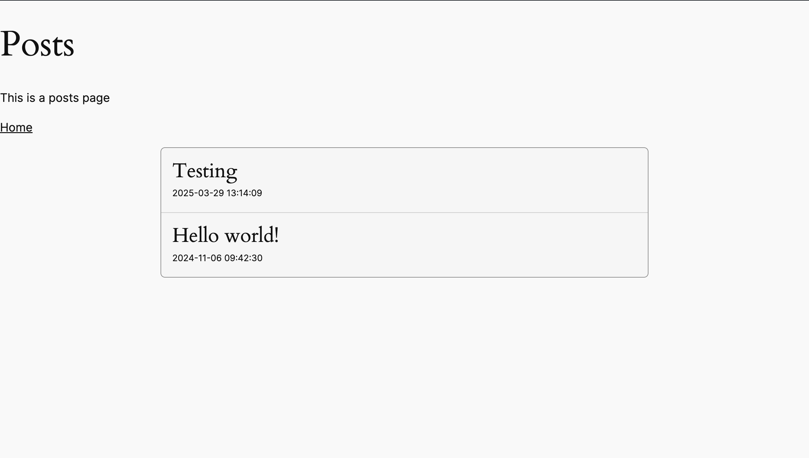

# Inertia WordPress Plugin

A demonstration plugin that showcases how to integrate React.js with WordPress using Inertia.js. It allows you to build modern, single-page applications while leveraging WordPress as your backend.

## Screenshots



## What is Inertia.js?

[Inertia.js](https://inertiajs.com/) is a modern approach to building classic server-driven web apps. It lets you create fully client-side rendered apps without building an API, by maintaining classic server-side routing and controllers. This demo shows how to integrate this approach with WordPress.

## Basic Setup

1. Download the plugin files
2. Upload the plugin folder to the `/wp-content/plugins/` directory
3. Navigate to the plugin directory
4. Install dependencies:
   ```bash
   npm install
   ```
5. Build assets:
   ```bash
   npm run build
   ```
6. Activate the plugin through the 'Plugins' menu in WordPress
7. Access the demo pages through this endpoint:
   - Home page: `/inertia/v2`
   - Posts page: `/inertia/v2/posts`

## License

This plugin is licensed under the GPL v2 or later.

## Credits

- Built with [Inertia.js](https://inertiajs.com/)
- Developed for WordPress by [Utsav Ladani](https://github.com/Utsav-Ladani)
